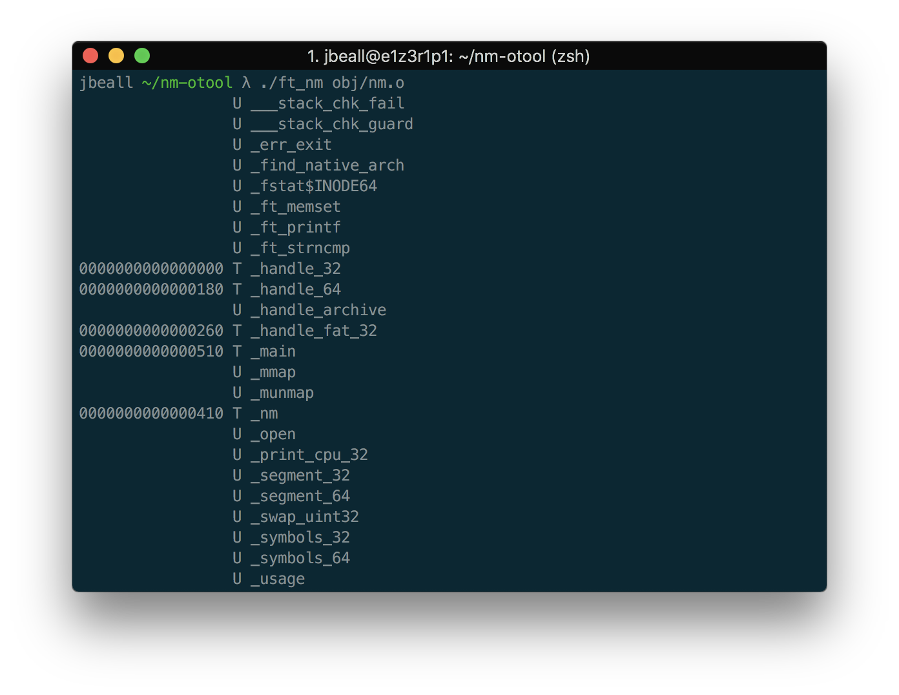
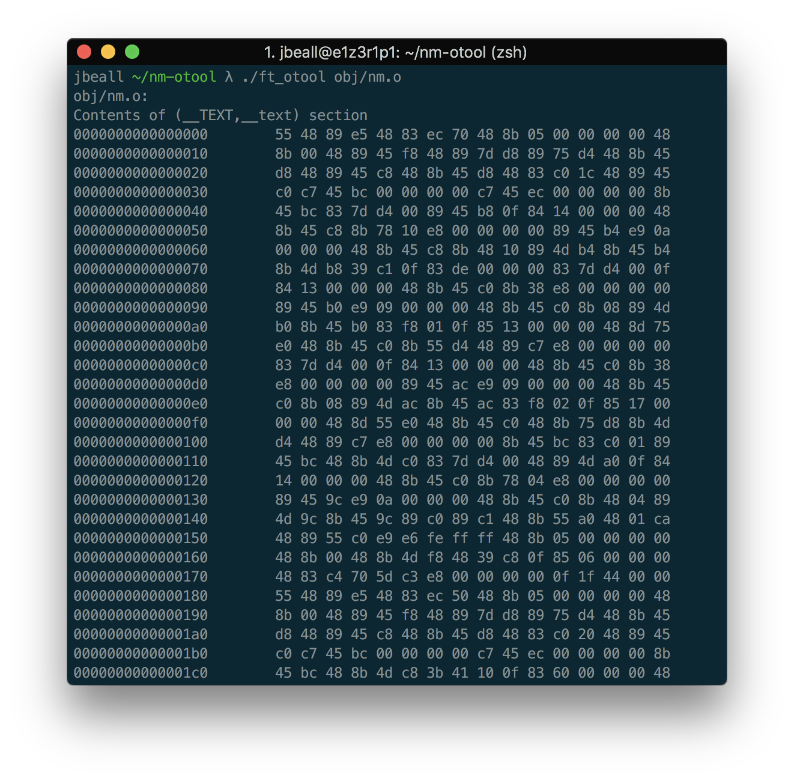

# nm-otool
A recode of the nm and otool utilities for inspecting Mach-O binaries, archives, libraries, and objects.

See `man otool` and `man nm`

This has been built for and tested on macOS only

### Build
run `make`

### Usage
`./ft_nm file`

`./ft_otool file`
